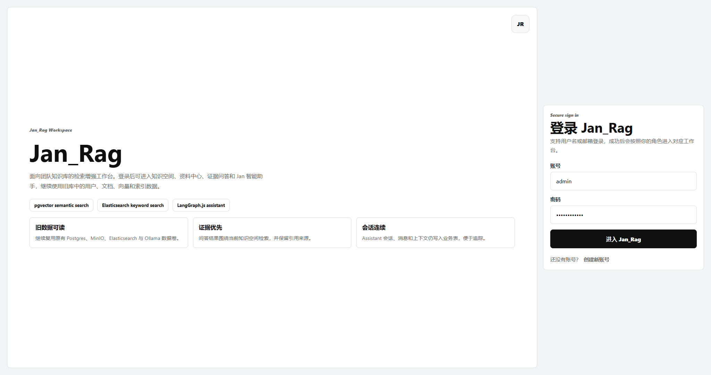
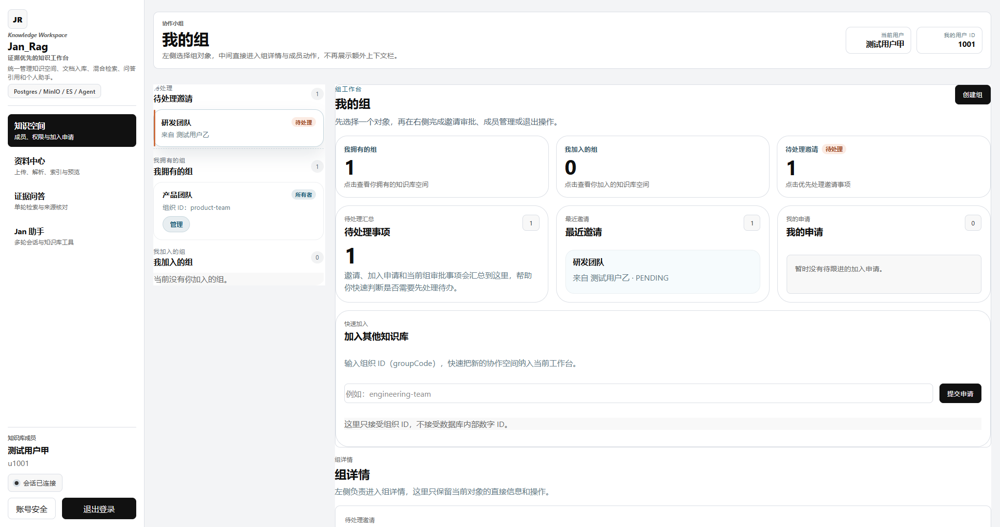
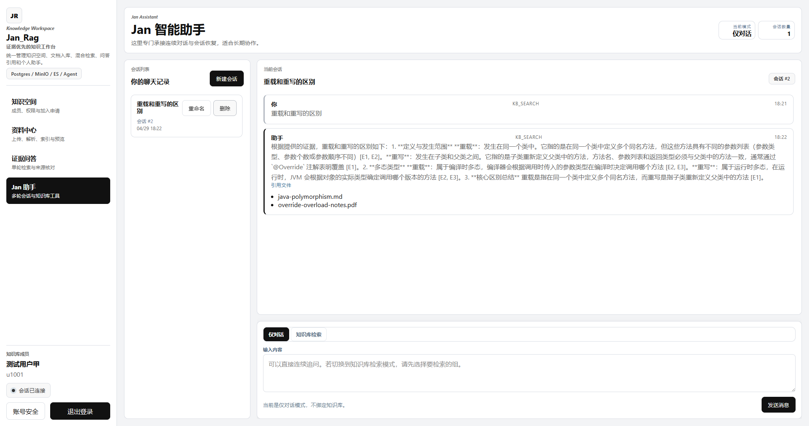
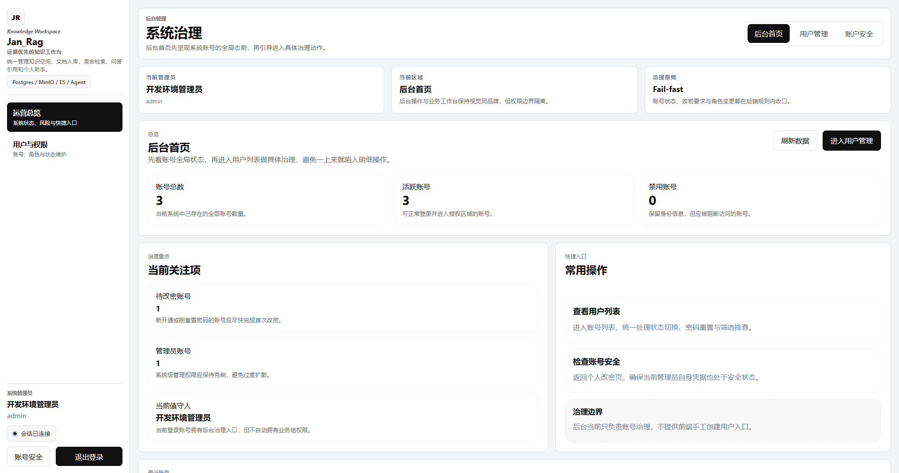
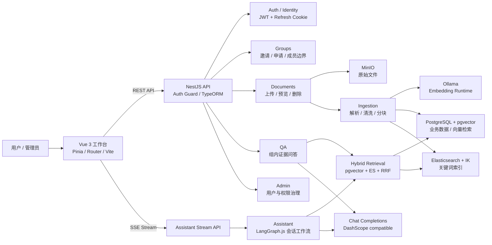
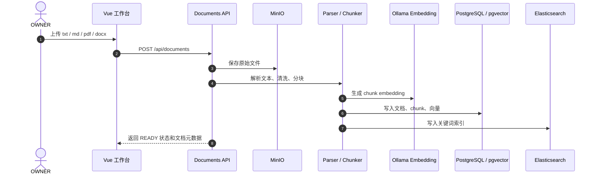
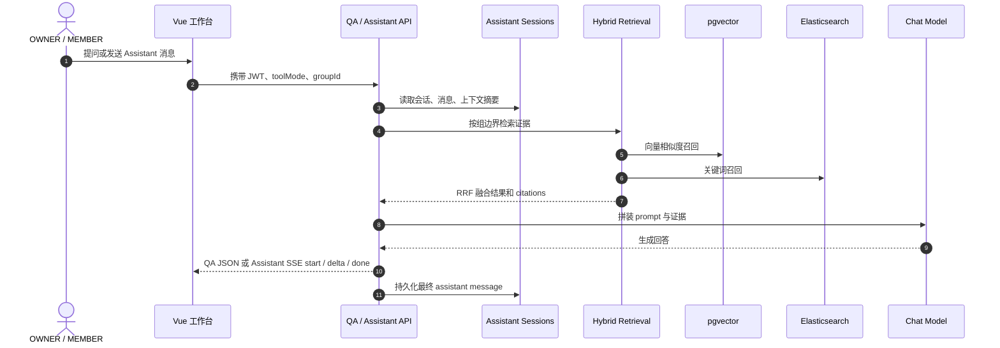

# Jan_Rag

Jan_Rag 是一个基于 NestJS + Vue 3 的 RAG 知识库与智能助手项目。项目提供用户认证、群组协作、文档上传与解析、混合检索、基于证据的问答、Assistant 多轮会话和后台用户管理能力。

## 功能特性

- JWT access token + HttpOnly refresh cookie 认证
- 用户注册、登录、刷新会话、修改密码
- 群组创建、加入申请、邀请、成员管理
- 文档上传、解析、分块、向量化、索引与预览
- PostgreSQL/pgvector + Elasticsearch 的混合检索
- 组内 QA 问答与引用来源展示
- Assistant `CHAT` / `KB_SEARCH` 模式与 SSE 流式响应
- Admin 用户与权限管理
- 黑白灰控制台风格 Vue 前端

## 技术栈

- Backend: NestJS, TypeORM, LangGraph.js
- Frontend: Vue 3, Vite, TypeScript, Pinia, Vue Router
- Database: PostgreSQL + pgvector
- Search: Elasticsearch + IK analyzer
- Object Storage: MinIO
- Embedding Runtime: Ollama
- Container: Docker Compose

## 效果图展示

以下截图位于 `docs/images/`，用于展示主要页面效果。

### 登录入口

<p align="center">
  
</p>

### 知识空间

<p align="center">
  
</p>

### Jan 智能助手

<p align="center">
  
</p>

### 后台治理

<p align="center">
  
</p>

## 系统架构



## 核心链路

### 文档入库链路



### 问答与 Assistant 链路



## 项目结构

```text
backend/      NestJS 后端服务
frontend/     Vue 3 前端应用
docs/images/  README 效果图资源
docker/       Docker 相关资源
docker-compose.yml
.env.example
README.md
```

## 环境要求

- Docker 与 Docker Compose
- Node.js 22+，用于本地前后端开发
- 可选：DashScope 兼容 API Key，用于真实大模型回答

## 快速启动

复制环境变量示例：

```bash
cp .env.example .env
```

Windows PowerShell:

```powershell
Copy-Item .env.example .env
```

创建 Docker Compose 使用的外部数据卷：

```bash
docker volume create jan_rag_postgres-data
docker volume create jan_rag_elasticsearch-data
docker volume create jan_rag_minio-data
docker volume create jan_rag_ollama-data
```

启动服务：

```bash
docker compose up -d --build
```

访问地址：

- Frontend: http://localhost:5173
- Backend API: http://localhost:18080/api
- MinIO Console: http://localhost:9001
- Elasticvue: http://localhost:8088

Docker Compose 中的前端容器会先构建 Vue 静态资源，再通过 Nginx 对外提供页面；浏览器访问 `/api` 时由 Nginx 反向代理到 `backend:3000`。

## 本地开发

后端：

```bash
cd backend
npm install
npm run dev
```

前端：

```bash
cd frontend
npm install
npm run dev
```

前端默认通过 `/api` 访问后端；开发代理目标由 `VITE_DEV_PROXY_TARGET` 控制。

## 环境变量

公开模板为 `.env.example`。本地真实配置写入 `.env`，不要提交 `.env`。

常用变量：

- `DATABASE_URL`: PostgreSQL 连接串
- `JWT_SECRET`: JWT 签名密钥，生产环境必须替换
- `MINIO_ENDPOINT`: MinIO 服务地址
- `MINIO_ACCESS_KEY`: MinIO access key
- `MINIO_SECRET_KEY`: MinIO secret key
- `MINIO_BUCKET`: 文档对象存储 bucket
- `ELASTICSEARCH_HOST`: Elasticsearch host
- `ELASTICSEARCH_INDEX_NAME`: 文档 chunk 索引名
- `OLLAMA_BASE_URL`: Ollama 服务地址
- `OLLAMA_EMBEDDING_MODEL`: embedding 模型名
- `DASHSCOPE_API_KEY`: DashScope API Key
- `CHAT_BASE_URL`: Chat Completions 兼容接口地址
- `CHAT_MODEL`: 聊天模型名

如果使用 Docker Compose，后端容器会读取根目录 `.env`。如果你的 `DASHSCOPE_API_KEY` 只配置在宿主机系统环境变量中，请确保它也被传入容器环境；最简单的开发方式是在本地 `.env` 中填写该变量。

## 构建与测试

后端构建：

```bash
cd backend
npm run build
```

后端测试：

```bash
cd backend
npm test
```

前端构建：

```bash
cd frontend
npm run build
```

## 安全注意事项

- 不要提交 `.env`、真实 API Key、数据库密码、JWT secret、MinIO 密钥或生产环境配置。
- `.env.example` 只用于说明变量名和本地开发默认值。
- `docker-compose.yml` 中的默认账号密码仅适合本地开发，生产部署必须替换。
- 生产环境建议使用服务器环境变量、部署平台 Secret 或 GitHub Actions Secrets 管理敏感信息。
