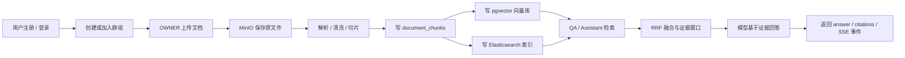

# Jan_Rag 业务流程快速上手与面试问答

本文用于快速理解 Jan_Rag 的核心业务链路，也可以作为面试前的项目讲解提纲。内容基于当前代码实现整理，重点覆盖认证、群组权限、文档入库、RAG 问答、Assistant 会话、后台治理与部署。

## 1. 项目定位

Jan_Rag 是一个面向组织内部知识管理的 RAG 知识库与 AI 助手系统。业务用户可以创建或加入知识空间，OWNER 上传文档，系统完成解析、切片、向量化和索引构建；成员可以在群组范围内进行证据约束问答，也可以通过 Assistant 进行普通聊天或知识库检索模式的多轮对话。

技术栈：

- 后端：NestJS 11、TypeScript、TypeORM、Express
- 前端：Vue 3、Vite、Pinia、Vue Router
- 数据库：PostgreSQL + pgvector
- 检索：Elasticsearch + IK analyzer
- 对象存储：MinIO
- Embedding：Ollama
- Agent：LangGraph.js
- 模型调用：DashScope / OpenAI-compatible Chat Completions
- 部署：Docker Compose、Nginx

核心代码入口：

- 后端模块装配：`backend/src/app.module.ts`
- 全局认证守卫：`backend/src/auth/auth.guard.ts`
- 认证与用户：`backend/src/auth/`、`backend/src/users/`、`backend/src/identity/`
- 群组协作：`backend/src/groups/`
- 文档管理：`backend/src/documents/`
- 文档入库：`backend/src/ingestion/`
- 检索与模型：`backend/src/retrieval/`
- QA 问答：`backend/src/qa/`
- Assistant：`backend/src/assistant/`
- 数据库基线：`backend/src/database/flyway-baseline/`
- 前端页面路由：`frontend/src/router/index.ts`

代码阅读范围：

- 后端以 Controller 找业务入口，以 Service 找权限校验、状态流转和外部依赖调用，以 Flyway baseline 找数据库约束。
- 前端以 Router 找页面边界，以 `frontend/src/api/` 找 HTTP 合约，以 Pinia store 找登录态和当前组上下文。
- 重点交叉核对了后端真实接口路径、前端调用路径、系统角色跳转、群组 OWNER/MEMBER 差异、文档同步入库、RAG 检索回表过滤、Assistant SSE 事件。

## 2. 整体业务主线

用户访问路径：

- `/login`、`/register`：认证入口
- `/groups`：知识空间与群组协作
- `/documents`：文档上传、列表、预览、删除
- `/qa`：证据约束问答
- `/assistant`：多轮 Assistant
- `/admin`：后台用户治理

业务总览：

| 业务 | 主要页面 | 后端入口 | 谁能操作 | 核心数据 |
| --- | --- | --- | --- | --- |
| 认证与会话 | `/login`、`/register`、`/account/security` | `/api/auth/*`、`/api/account/change-password` | 访客、已登录用户 | `users`、`user_refresh_tokens` |
| 群组协作 | `/groups` | `/api/groups/*`、`/api/invitations/*` | USER，按 OWNER/MEMBER 分权 | `groups`、`group_memberships`、`group_invitations`、`group_join_requests` |
| 文档管理 | `/documents` | `/api/documents/*` | OWNER 管理，OWNER/MEMBER 查看 | `documents`、`document_chunks`、MinIO、`vector_store`、ES |
| QA 问答 | `/qa` | `/api/qa/ask` | OWNER/MEMBER | `document_chunks`、`documents`、pgvector、ES |
| Assistant | `/assistant` | `/api/assistant/*` | USER | `assistant_sessions`、`assistant_messages`、`assistant_session_contexts` |
| 后台治理 | `/admin/*` | `/api/admin/users/*` | ADMIN | `users`、`user_refresh_tokens` |
| 部署运行 | Docker Compose | Nginx `/api` 代理到 backend | 运维/开发 | PostgreSQL、ES、MinIO、Ollama、backend、frontend |

## 3. 认证与会话业务

### 业务流程

1. 用户注册时提交 `username`、`email`、`displayName`、`password`。
2. 后端校验用户名、邮箱、密码策略，并用 bcrypt 存储密码哈希。
3. 登录时支持用户名或邮箱作为 `loginId`。
4. 登录成功后返回 access token，同时把 refresh token 写入 HttpOnly Cookie。
5. 前端普通接口使用 `Authorization: Bearer <accessToken>`。
6. access token 过期后调用 `/api/auth/refresh`，后端校验 refresh token 并轮换新 token。
7. 登出、改密、禁用用户时会撤销 refresh token。

核心接口：

- `POST /api/auth/register`
- `POST /api/auth/login`
- `POST /api/auth/refresh`
- `POST /api/auth/logout`
- `GET /api/auth/me`
- `POST /api/account/change-password`

核心表：

- `users`
- `user_refresh_tokens`

关键设计：

- access token 有较短有效期，默认 30 分钟。
- refresh token 存入 HttpOnly Cookie，降低被前端脚本读取的风险。
- refresh token 只存哈希，不明文落库。
- 前端 access token 保存在 Pinia 内存态，并写入 Axios 默认 Authorization 头；页面刷新后优先通过 refresh cookie 恢复会话。
- 登录时撤销用户已有未过期 refresh token，减少多端旧会话残留。
- 全局 `AuthGuard` 拦截非 `@Public()` 接口，把解析出的用户写入 `request.authenticatedUser`。
- `IdentityService` 每次从数据库复查用户状态，避免禁用用户继续使用旧 token。

### 面试可能追问

**问题：为什么 access token 和 refresh token 要分开？**  
答法：access token 用于接口鉴权，生命周期短，泄露窗口小；refresh token 用于续期，生命周期长，所以放在 HttpOnly Cookie 并且只存哈希。这样可以兼顾用户体验和安全性。

**问题：为什么 refresh token 还要轮换？**  
答法：每次 refresh 后旧 token 会被撤销并签发新 token，可以降低重放风险。如果旧 token 被截获，后续也更容易失效。

**问题：JWT 里已经有用户信息，为什么还要查数据库？**  
答法：JWT 是无状态的，但用户可能被禁用、角色可能变化。`IdentityService` 会在关键接口重新加载用户状态，保证后台禁用、改密等操作能及时生效。

**问题：bcrypt 有什么注意点？**  
答法：bcrypt 对输入有 72 bytes 限制，项目里显式校验了密码长度，避免超长密码被截断后产生安全误解。

**问题：如果要支持多端登录怎么办？**  
解决方法：当前登录会撤销同用户其他 refresh token。如果要支持多端，可以增加 `device_id`、`user_agent`、`ip`、`last_seen_at` 字段，按设备维度撤销 token，而不是按用户全量撤销。

**问题：为什么 access token 不放 localStorage？**  
答法：当前前端只把 access token 放在运行时内存和 Axios 默认头里，刷新页面后依靠 HttpOnly refresh cookie 恢复，减少 XSS 后长期令牌被直接读取的风险。代价是页面刷新必须走一次 refresh。

## 4. 群组与知识空间权限业务

### 业务流程

1. 普通用户创建群组后自动成为 OWNER。
2. OWNER 可以邀请其他用户加入群组。
3. 用户也可以通过 `groupCode` 主动提交加入申请。
4. OWNER 审批申请后，申请人成为 MEMBER。
5. OWNER 可以查看成员、移除 MEMBER，但不能移除 OWNER。
6. MEMBER 可以退出群组，OWNER 不能直接退出自己的群组。
7. ADMIN 不进入业务工作台，后台管理和业务空间隔离。

核心接口：

- `GET /api/groups/my`
- `POST /api/groups`
- `POST /api/groups/:groupId/invitations`
- `POST /api/invitations/:invitationId/accept`
- `POST /api/groups/join-requests`
- `GET /api/groups/:groupId/join-requests`
- `POST /api/groups/:groupId/join-requests/:requestId/approve`
- `GET /api/groups/:groupId/members`
- `DELETE /api/groups/:groupId/members/:userId`

核心表：

- `groups`
- `group_memberships`
- `group_invitations`
- `group_join_requests`

关键设计：

- `group_memberships.role` 只有 `OWNER` 和 `MEMBER`。
- 数据库通过部分唯一索引保证一个群组只有一个 OWNER。
- 邀请和加入申请都有 `PENDING` 唯一约束，避免重复待处理记录。
- `requireGroupReadable()` 统一校验用户是否属于群组。
- `requireGroupOwner()` 统一校验 OWNER 权限。

### 面试可能追问

**问题：知识库权限隔离是怎么做的？**  
答法：不是只在向量库打标签，而是 `groupId` 贯穿业务表、切片表、向量 metadata 和 ES 索引。进入 QA 或 Assistant 检索前先查 `group_memberships` 校验当前用户是否属于目标群组，检索时再对 pgvector 和 Elasticsearch 都加 `groupId` 过滤。

**问题：为什么按群组隔离，而不是按用户隔离？**  
答法：知识库是组织协作场景，文档通常属于团队或项目空间。按群组隔离可以支持 OWNER/MEMBER 协作，也方便做成员变更、文档共享和统一检索。

**问题：如何防止用户篡改前端传来的 groupId？**  
答法：后端不信任前端传参。文档、QA、Assistant 等接口都会调用 `requireGroupReadable()` 或 `requireGroupOwner()`，用当前 token 中的用户 ID 到数据库校验成员关系。

**问题：为什么 ADMIN 不能直接访问业务工作台？**  
答法：ADMIN 是系统治理角色，负责用户状态和密码重置，不应该绕过业务成员关系读取群组知识库。这样能减少越权访问风险，也让权限边界更清晰。

**问题：如果企业需要更细粒度权限怎么办？**  
解决方法：可以在 `documents` 增加可见范围，或增加 `document_acl` 表，支持文档级、目录级、标签级权限。检索时把 `groupId` 过滤扩展为 `groupId + document_id in allowed_docs`。

## 5. 文档上传与入库业务

### 业务流程

1. OWNER 在文档页面选择群组并上传文件。
2. 后端校验用户是否为目标群组 OWNER。
3. 校验文件大小和类型，目前支持 `txt`、`md`、`pdf`、`docx`。
4. 原文件写入 MinIO，对象路径格式为 `groups/{groupId}/users/{userId}/{uuid}.{ext}`。
5. `documents` 表插入 `PROCESSING` 状态记录。
6. `IngestionService` 从 MinIO 读取文件并解析文本。
7. 文本清洗后写入 `preview_text`。
8. 按目标长度、最大长度和 overlap 做结构感知切片。
9. 切片写入 `document_chunks`。
10. 切片写入 pgvector 的 `vector_store`。
11. 切片写入 Elasticsearch。
12. 全部成功后文档状态改为 `READY`。
13. 任一环节失败时清理向量、ES 索引和 MinIO 原文件，并把文档状态改为 `FAILED`。

核心接口：

- `POST /api/documents/upload`
- `GET /api/documents`
- `GET /api/documents/:documentId/preview`
- `DELETE /api/documents/:documentId`

核心表：

- `documents`
- `document_chunks`
- `ingestion_jobs`，当前表已建好，代码当前上传链路是同步入库
- `vector_store`，由 `EmbeddingService` 初始化

关键设计：

- 只有 OWNER 可以上传和删除文档，OWNER/MEMBER 都可以列表、预览和问答。
- 文档删除是业务表软删除，同时删除向量和 ES 索引，避免被召回。
- 删除文档当前不会删除 MinIO 原文件；如果生产环境需要降低存储成本或满足合规擦除，应补充对象删除和失败补偿。
- `document_chunks` 上有 `(document_id, chunk_index)` 唯一约束。
- `document_chunks(document_id, group_id)` 外键引用 `documents(id, group_id)`，保证切片和文档处于同一群组。
- `metadata_json` 和向量库 metadata 都保存 `documentId`、`groupId`、`chunkIndex`、`fileName` 等检索上下文。
- 前端文档页会把 `uploadedFrom`、`uploadedTo` 传给接口并在本地做日期过滤；后端当前实际只消费 `groupId`、`groupRelation`、`fileName`、`uploaderUserId`、`status`。

### 面试可能追问

**问题：文档入库为什么要先存 MinIO？**  
答法：原文件和解析结果职责不同。MinIO 保存原始文件，方便重试、审计和重新解析；数据库保存文档元数据、切片和预览文本；检索引擎保存召回所需的数据。

**问题：上传链路失败如何保证一致性？**  
答法：业务上采用补偿清理。文档处理失败后会删除已写入的向量、ES 文档和 MinIO 原文件，并把文档状态标记为 `FAILED`。这不是严格分布式事务，但对搜索、对象存储、数据库混合系统更实用。

**问题：为什么当前是同步入库？有什么问题？**  
答法：同步入库实现简单，便于本地演示和端到端验证。但大文件或模型服务慢时会阻塞请求。生产环境更适合把 `ingestion_jobs` 用起来，上传后快速返回 `PROCESSING`，后台 worker 异步解析、重试和更新状态。

**问题：如何设计异步入库队列？**  
解决方法：上传接口只保存原文件和 `documents` 记录，再插入 `ingestion_jobs`。worker 按 `status`、`next_retry_at` 拉取任务，使用 `for update skip locked` 或 Redis 队列防止并发重复消费；失败递增 `retry_count`，超过次数标记 `FAILED`。

**问题：切片策略怎么设计？**  
答法：当前按字符长度控制，结合段落和句子边界，设置 target、max 和 overlap。这样能避免切片过碎，也能通过 overlap 保留上下文连续性。生产可进一步按 token 估算、标题层级、Markdown 结构或 PDF 页码切片。

**问题：为什么删除文档要同步删向量和 ES？**  
答法：RAG 的最终答案取决于召回结果。如果业务表标记删除但索引没删，已删除知识仍可能被模型引用，所以删除链路必须同步清理检索侧数据，或在检索时强制二次回表校验。

**问题：文档列表时间筛选为什么可能前后端结果不一致？**  
解决方法：当前前端传了 `uploadedFrom`、`uploadedTo`，并在前端二次过滤，但后端 `DocumentsService.list()` 还没有下推时间条件。生产上应在 SQL 中增加 `uploaded_at >= uploadedFrom` 和 `uploaded_at <= uploadedTo`，再保留前端本地过滤作为体验层兜底。

## 6. RAG 混合检索与 QA 业务

### 业务流程

1. 用户在 QA 页面选择群组并提问。
2. 后端校验用户属于该群组。
3. `QueryPlanningService` 尝试用模型把问题改写或拆解为最多 3 个检索 query。
4. 每个 query 同时走向量检索和关键词检索。
5. 向量检索：Ollama 生成问题 embedding，pgvector 按余弦距离召回。
6. 关键词检索：Elasticsearch + IK analyzer，对文件名和 chunkText 做 phrase/match 检索。
7. 两路结果通过 RRF 融合排序。
8. 对融合后的 chunk 回查 `document_chunks` 和 `documents`，确认 `groupId`、`READY`、未删除。
9. 为每个命中 chunk 拼接前后相邻切片，形成 evidence window。
10. 根据证据数量和来源生成 `evidenceLevel`。
11. QA prompt 要求模型只能基于 evidence 回答，证据不足则拒答。
12. 返回 `answered`、`answer`、`reasonCode`、`reasonMessage`、`citations`。

核心接口：

- `POST /api/qa/ask`

核心服务：

- `QaService`
- `HybridRetrievalService`
- `EmbeddingService`
- `ElasticsearchService`
- `QueryPlanningService`
- `ChatModelService`

关键设计：

- pgvector 存储语义向量，适合表达相近但字面不同的问题。
- Elasticsearch 适合专有名词、编号、文件名和关键词精确召回。
- RRF 不强依赖不同检索器分数尺度，适合融合向量和关键词排名。
- evidence window 使用命中切片的前后邻居，缓解单个 chunk 上下文不足。
- 最终答案必须引用检索证据，检索为空则直接返回 `INSUFFICIENT_EVIDENCE`。
- 如果未配置真实聊天模型 API Key，QA 在有证据时会返回“已检索到证据但未配置模型”的兜底答案，检索为空仍拒答。

### 面试可能追问

**问题：为什么不用纯向量检索？**  
答法：纯向量检索对语义相似问题效果好，但对编号、专有名词、文件名、缩写等精确匹配不稳定。ES 可以补充关键词召回，混合检索覆盖面更好。

**问题：RRF 是什么，为什么适合这里？**  
答法：RRF 是 Reciprocal Rank Fusion，核心是按排名贡献分数，例如 `1 / (k + rank)`。它不要求 pgvector 分数和 ES 分数同尺度，只要各自排序可靠，就能稳定融合。

**问题：如何降低大模型幻觉？**  
答法：第一层是检索前按群组过滤；第二层是检索后回表确认文档状态；第三层是 prompt 要求只基于 evidence 回答；第四层是没有证据时拒答；第五层是返回 citations 方便用户追溯来源。

**问题：为什么检索后还要回表？**  
答法：向量库和 ES 可能存在延迟或脏数据。回表检查 `groupId`、文档 `READY`、`deleted=false` 可以作为最后一道数据一致性保护。

**问题：检索为空时怎么处理？**  
答法：QA 接口直接返回 `answered=false` 和 `INSUFFICIENT_EVIDENCE`，不让模型自由发挥。Assistant 的 KB_SEARCH 模式也会把空 evidence 传给模型并要求拒答。

**问题：如何进一步提升问答准确率？**  
解决方法：可以增加 reranker、按文档标题/章节加权、改进 query planning、用 BM25 + vector + rerank 三阶段召回、引入引用片段高亮，并对 answer 做 citation coverage 检查。

**问题：模型没配置时系统还能验证什么？**  
答法：仍可以验证认证、群组权限、文档入库、pgvector/ES 召回、RRF 融合和 citations 返回。只是最终自然语言生成会走兜底文案，所以本地联调可以先看检索链路，再接入 `DASHSCOPE_API_KEY` 验证答案质量。

## 7. Assistant 多轮对话业务

### 业务流程

1. 用户进入 Assistant 页面创建或选择会话。
2. 会话保存在 `assistant_sessions`。
3. 用户消息保存到 `assistant_messages`。
4. 请求有两种模式：
   - `CHAT`：普通聊天，不允许传 `groupId`。
   - `KB_SEARCH`：知识库检索，必须传 `groupId` 并校验群组可读权限。
5. `AssistantAgentService` 用 LangGraph.js 编排两个节点：
   - `knowledge_base_search`：KB_SEARCH 模式下调用混合检索。
   - `model`：加载最近消息和摘要上下文，拼 prompt 调模型。
6. 非流式接口直接返回完整回复。
7. 流式接口使用 SSE，事件包括 `start`、`delta`、`done`、`error`。
8. 回复完成后保存 ASSISTANT 消息，并返回 citations。
9. 首条用户消息会自动把会话标题改成消息前 24 个字符。

核心接口：

- `POST /api/assistant/sessions`
- `GET /api/assistant/sessions`
- `GET /api/assistant/sessions/:sessionId`
- `PATCH /api/assistant/sessions/:sessionId`
- `DELETE /api/assistant/sessions/:sessionId`
- `GET /api/assistant/sessions/:sessionId/context`
- `POST /api/assistant/chat`
- `POST /api/assistant/chat/stream`

核心表：

- `assistant_sessions`
- `assistant_messages`
- `assistant_session_contexts`

关键设计：

- 会话归属于用户，所有会话读写都会校验 `session.user_id`。
- 消息表记录 `role`、`tool_mode`、`group_id`、`content`、`structured_payload`。
- 数据库约束保证 `group_id` 只在 `KB_SEARCH` 模式下出现。
- 当前代码会读取 `assistant_session_contexts` 中的 `session_memory` 或 `compact_summary` 注入 prompt。
- 当前自动摘要更新逻辑还未完全接入，prompt 文件已经预留了 session memory、compact summary、runtime compact summary 的模板。
- 前端流式聊天没有使用 `EventSource`，而是用 `fetch` 发 POST 请求并读取 ReadableStream，因为请求需要携带 JSON body 和 Bearer Token。
- 删除会话当前是硬删除上下文、消息和会话记录；如果生产需要审计，可以改成 `status='DELETED'` 的软删除。

### 面试可能追问

**问题：Assistant 和 QA 有什么区别？**  
答法：QA 是一次性证据问答，输入 groupId 和 question，返回结构化 answer。Assistant 是会话型能力，有 session、历史消息、上下文摘要和流式输出，并且支持 CHAT / KB_SEARCH 两种模式。

**问题：为什么用 LangGraph.js？**  
答法：Assistant 不只是单次模型调用，它有状态、工具调用和条件逻辑。LangGraph 可以把检索节点、模型节点、未来的工具节点组织成显式图结构，后续扩展 Agent 工具更清晰。

**问题：上下文压缩怎么做？当前实现到什么程度？**  
答法：当前表结构和 prompt 已经支持 `session_memory` 与 `compact_summary`，运行时会读取摘要和最近 12 条消息放入 prompt。当前代码还没有完整自动写入摘要的 worker。面试时要诚实说明：已完成上下文承载结构和读取链路，后续可在消息数或 token 数达到阈值时触发压缩写回。

**问题：如果让你完善上下文压缩，会怎么做？**  
解决方法：以 `assistant_messages.id` 作为游标，最近 N 条保留原文，较早消息压缩到 `compact_summary`；把用户目标、关键事实、决策、未解决问题保留下来；用 `context_version` 做并发版本控制，避免多个请求同时覆盖摘要。

**问题：Agent 队列控制怎么设计？**  
答法：当前单次请求内 LangGraph 是顺序执行的，但同一 session 并发发送消息时可能出现回复乱序。可以按 `sessionId` 建立队列或互斥锁：同一会话一次只运行一个 Agent；请求进入 `PENDING/RUNNING/DONE/FAILED` 状态；SSE 支持取消；用 Redis lock、BullMQ 或数据库 `for update skip locked` 实现。

**问题：SSE 为什么要拆 start/delta/done/error？**  
答法：前端可以明确区分开始生成、增量文本、最终落库消息和异常状态。`done` 事件携带最终 `messageId`、`reply` 和 `citations`，便于前端把临时消息替换成正式消息。

**问题：为什么前端流式接口不用浏览器原生 EventSource？**  
答法：`EventSource` 更适合 GET 订阅，携带复杂 JSON body 和自定义 Authorization 头不方便。当前前端用 `fetch` POST `/api/assistant/chat/stream`，然后手动解析 SSE 文本帧，既保留流式体验，也能传 `sessionId`、`toolMode`、`groupId` 和 access token。

**问题：KB_SEARCH 模式下如何防止越权检索？**  
答法：`validateRequest()` 要求 KB_SEARCH 必须传 `groupId`，并调用 `requireGroupReadable()`。真正检索时 pgvector 和 ES 也都按同一个 `groupId` 过滤。

**问题：删除会话为什么要考虑软删除？**  
解决方法：当前实现直接删除 `assistant_session_contexts`、`assistant_messages` 和 `assistant_sessions`，适合演示和普通用户清理。若要满足审计、恢复或风控需求，应改成更新会话状态为 `DELETED`，消息保留并加查询过滤，同时增加数据保留周期和管理员审计入口。

## 8. 后台用户治理业务

### 业务流程

1. ADMIN 进入 `/admin` 后台。
2. 后端通过 `requireSystemAdmin()` 校验系统角色。
3. ADMIN 可以查看用户列表和用户详情。
4. ADMIN 可以禁用或启用用户。
5. 禁用用户时撤销该用户所有活跃 refresh token。
6. ADMIN 可以重置用户密码，重置后 `must_change_password=true`，并撤销 refresh token。
7. 普通业务用户不能访问 `/admin` 路由，也不能调用后台接口。

核心接口：

- `GET /api/admin/users`
- `GET /api/admin/users/:userId`
- `PATCH /api/admin/users/:userId/status`
- `POST /api/admin/users/:userId/reset-password`

核心表：

- `users`
- `user_refresh_tokens`

关键设计：

- ADMIN 和 USER 是系统级角色。
- `IdentityService.requireSystemAdmin()` 是后台统一入口。
- `IdentityService.requireBusinessUser()` 阻止 ADMIN 进入业务空间。
- 禁用和重置密码都会撤销 refresh token，强制用户重新认证。
- 后台当前没有前端手工创建用户入口；普通用户通过注册创建，管理员主要做状态治理和密码重置。

### 面试可能追问

**问题：为什么后台管理员不能直接看业务知识库？**  
答法：后台管理员负责系统治理，不等于业务空间成员。把系统权限和业务权限分开，可以避免管理员天然拥有所有知识库内容读取权。

**问题：用户被禁用后，旧 access token 还能用吗？**  
答法：接口层会通过 `IdentityService` 查库检查用户状态，所以即使 JWT 尚未过期，被禁用用户访问接口也会被拒绝。refresh token 也会被撤销。

**问题：重置密码为什么要设置 mustChangePassword？**  
答法：管理员设置的是临时密码，用户首次登录后应该修改为自己掌握的密码。`mustChangePassword` 可以驱动前端跳转到账户安全页面。

**问题：如果要做审计怎么扩展？**  
解决方法：增加 `admin_audit_logs` 表，记录 operator、target_user、action、before/after、ip、user_agent、created_at；对禁用、启用、重置密码等敏感操作都落审计。

**问题：如果企业不允许公开注册，后台应该怎么改？**  
解决方法：关闭或限制 `/api/auth/register`，在后台增加创建用户接口，管理员创建初始账号并设置 `must_change_password=true`；也可以接入企业 SSO，让本系统只保存用户映射、系统角色和业务群组关系。

## 9. 部署与工程化链路

### 启动流程

1. 复制 `.env.example` 为 `.env`。
2. 创建 Docker 外部数据卷。
3. `docker compose up -d --build` 启动服务。
4. PostgreSQL、Elasticsearch、MinIO、Ollama 先启动并通过健康检查。
5. `ollama-model-init` 拉取 embedding 模型。
6. backend 等依赖健康后启动。
7. frontend 使用 Nginx 提供 Vue 静态资源，并把 `/api` 反向代理到 backend。

核心服务：

- `postgres`：PostgreSQL + pgvector
- `elasticsearch`：带 IK analyzer 的 Elasticsearch
- `minio`：对象存储
- `ollama`：embedding runtime
- `backend`：NestJS API
- `frontend`：Nginx + Vue 静态资源
- `elasticvue`：ES 可视化工具

关键设计：

- Docker Compose 使用 healthcheck 控制启动顺序。
- 前端容器不直接运行 Vite，而是构建静态资源后由 Nginx 服务。
- Nginx 对 SPA 做 fallback，并代理 `/api`。
- `.env.example` 集中描述数据库、JWT、MinIO、ES、Ollama 和模型配置。

### 面试可能追问

**问题：为什么前端生产环境不用 Vite dev server？**  
答法：Vite dev server 适合开发，生产环境应该构建静态文件，用 Nginx 提供稳定的静态资源服务和反向代理能力。

**问题：为什么需要 healthcheck？**  
答法：容器启动不等于服务可用。backend 依赖数据库、ES、MinIO、Ollama，frontend 又依赖 backend。healthcheck 可以减少启动初期接口 502 或连接失败。

**问题：数据库迁移怎么管理？**  
答法：当前项目保留 Flyway baseline SQL，TypeORM `synchronize=false`，避免运行时自动改表。生产环境应通过迁移脚本管理 schema 变更。

**问题：如果模型或 embedding 服务不可用怎么办？**  
解决方法：当前 chat 未配置 API Key 时有 fallback 文案；embedding 失败会导致入库或检索失败。生产可加入任务重试、熔断降级、模型健康检查和失败告警。

## 10. 一分钟项目讲解模板

Jan_Rag 是我做的组织级 RAG 知识库与 AI 助手平台，后端基于 NestJS，前端基于 Vue 3。系统核心是按群组隔离知识空间，OWNER 上传文档后，文档会进入 MinIO 保存原文件，然后经过解析、清洗、切片，同时写入 PostgreSQL 的业务切片表、pgvector 向量库和 Elasticsearch 索引。用户提问时，系统先校验群组权限，再同时走向量召回和关键词召回，用 RRF 做融合排序，最后回表校验文档状态并拼接证据窗口，让模型只能基于证据回答，证据不足就拒答。

Assistant 部分基于 LangGraph.js，把知识库检索和模型调用编排成 Agent 流程，支持普通聊天和 KB_SEARCH 两种模式，并通过 SSE 返回 start、delta、done、error 事件。会话、消息和上下文摘要结构都落在数据库里，为后续长对话压缩、Agent 队列和工具扩展留了空间。工程化上用 Docker Compose 编排 PostgreSQL、ES、MinIO、Ollama、后端和前端，并通过健康检查保证服务启动顺序。

## 11. 面试高频追问总表

| 方向 | 高频问题 | 简短答法 |
| --- | --- | --- |
| 权限隔离 | 如何防止跨知识库检索？ | 入口校验成员关系，pgvector metadata 和 ES 索引都按 `groupId` 过滤，最终回表再次确认。 |
| RAG | 为什么混合检索？ | 向量检索补语义，ES 补关键词、文件名、专有名词，两者用 RRF 融合。 |
| 幻觉控制 | 如何降低幻觉？ | 证据为空拒答，prompt 限制只基于 evidence，返回 citations，检索后回表过滤脏数据。 |
| 入库一致性 | MinIO、DB、ES、向量库如何一致？ | 当前用补偿清理；生产可改为异步任务、状态机、重试和定期 reconcile。 |
| 文档筛选 | 时间筛选在哪里做？ | 前端会做本地过滤；后端当前未消费时间参数，生产应下推到 SQL。 |
| 长对话 | 上下文太长怎么办？ | 最近消息保留原文，历史消息压缩到 `compact_summary`，用消息游标和版本号防并发覆盖。 |
| 流式响应 | 为什么不用 EventSource？ | 需要 POST body 和 Authorization 头，所以用 `fetch` 读取 ReadableStream 并手动解析 SSE。 |
| Agent 并发 | 同一会话同时发多条消息怎么办？ | 按 session 维度排队或加互斥锁，任务状态机记录 PENDING/RUNNING/DONE/FAILED。 |
| 安全 | refresh token 为什么存哈希？ | 数据库泄露时不能直接拿 token 续期，降低长期凭证风险。 |
| 部署 | 为什么用 healthcheck？ | 保证依赖真正可用后再启动上层服务，减少启动期间 502 和连接失败。 |

## 12. 当前实现边界与可优化点

当前已实现：

- JWT + Refresh Cookie 认证和续期
- 用户注册、登录、改密、后台用户治理
- 群组创建、邀请、加入申请、成员管理
- 文档上传、MinIO 存储、解析、切片、向量化、ES 索引
- pgvector + Elasticsearch 混合检索
- RRF 融合排序、证据窗口、证据不足拒答
- Assistant 会话、消息持久化、LangGraph 编排、SSE 流式输出
- Docker Compose 一体化启动和健康检查

面试中可以主动说明的优化方向：

- 文档入库从同步改为异步队列，使用 `ingestion_jobs` 状态机和 worker 重试。
- 文档列表的上传时间筛选下沉到后端 SQL，避免只依赖前端本地过滤。
- 文档删除补充 MinIO 对象清理、删除失败重试和定期 reconcile。
- 为 `vector_store.metadata -> groupId` 增加表达式索引，提升带权限过滤的向量检索效率。
- 引入 reranker，提高 topK evidence 的相关性。
- 完善 `assistant_session_contexts` 的自动摘要写入和 token 预算控制。
- 按 session 维度增加 Agent 队列或锁，避免同一会话并发回复乱序。
- 增加审计日志、操作记录、文档级 ACL 和监控告警。
